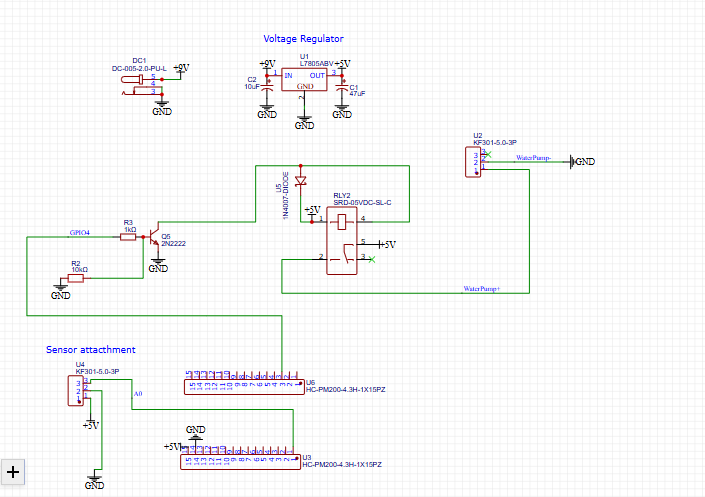

# ESP8266 Water Pump Controller

## Project Overview
A small IoT project to control a water pump via Wi-Fi using an ESP8266. The pump automatically runs for 2 seconds when triggered by an HTTP request.

## Features
- Turn the water pump on for 2 seconds
- Simple JSON response for app integration
- Wi-Fi credentials separated in `config.h` for security

## Setup Instructions
1. Copy `config.example.h` to `config.h` and fill in your Wi-Fi credentials.
2. Open the sketch in Arduino IDE.
3. Upload it to an ESP8266 board.
4. Send MQTT message  plant/pump/on  to trigger the pump.

## Demo

- `demo.png` is a screenshot of the pump or app in action.
- Clicking the image opens the hosted demo video 

### Communication and Network Testing

| Test ID | Test Description | Test Steps | Expected Result | Actual Result | Status |
|-------|------------------|-----------|-----------------|---------------|--------|
| T01 | ESP connects to Wi-Fi (LAN) | Power ESP on within home Wi-Fi network | ESP connects and obtains IP address | Connected successfully, IP assigned | [x] |
| T02 | MQTT broker connection | ESP attempts to connect to MQTT broker | MQTT connection established | Connected to HiveMQ broker | [x] |
| T03 | MQTT topic subscription | ESP subscribes to `plant/pump/on` topic | Subscription successful | Subscribed successfully | [x] |
| T04 | MQTT message receive (LAN) | Publish `on` to `plant/pump/on` from same network | ESP receives message | Message received correctly | [x] |
| T05 | MQTT message receive (Mobile Data) | Publish `on` to `plant/pump/on` via mobile network | ESP receives message | Message received correctly | [x] |
| T06 | Cross-network MQTT messaging | ESP on Wi-Fi, client on mobile data | Message received without delay | Successful cross-network delivery | [x] |

### Notes
- Relay hardware was not connected during this test phase.
- Testing focused on Wi-Fi connectivity and MQTT messaging.
- Relay and pump activation tests will be added in a later phase.