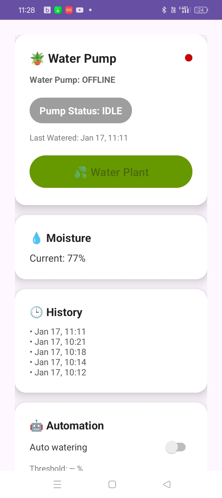

# ESP8266 Water Pump Controller (Smart Plant Watering)

  
   
  <em>ESP8266 + MQTT + Android app — manual and automated plant watering</em>

---

## Overview

This repository contains the **ESP8266 firmware** for a smart plant watering system.

The ESP8266 connects to Wi-Fi, communicates securely with **HiveMQ Cloud (MQTT over TLS)**, and controls a water pump via a relay.  
It supports both **manual watering** (triggered from an Android app) and **automated watering** based on soil moisture readings and configurable thresholds.

This firmware is part of a larger **end-to-end IoT system** that includes:
- an Android application
- MQTT-based messaging
- system-level testing and documentation

---

## Component Repositories

- **Android App (MQTT Publisher & UI)**  
  https://github.com/xlcMitchell/WaterPumpApp

- **ESP8266 Firmware (this repository)**  
  https://github.com/xlcMitchell/WaterPumpServer1.0

---

## System Behaviour

- ESP8266 connects to Wi-Fi on boot
- Establishes a secure MQTT connection to HiveMQ Cloud (TLS, port 8883)
- Publishes **ONLINE/OFFLINE** status using MQTT Last Will and Testament (LWT)
- Subscribes to pump control and auto-watering configuration topics
- Reads soil moisture at fixed intervals
- Controls pump using non-blocking timing logic
- Automatically shuts off pump after a configured duration (safety)

---

## Features

- Manual pump control via MQTT
- Automated watering based on soil moisture threshold
- Fixed cooldown period to prevent over-watering
- MQTT retained messages for state recovery
- Secure MQTT communication over TLS
- Non-blocking pump control logic
- Moisture readings published periodically
- Credentials isolated in `config.h` (excluded from Git)

---

## MQTT Topics

| Topic | Direction | Retained | Description |
|------|----------|----------|------------|
| `plant/pump/on` | App → ESP | No | Manual pump command (`on`) |
| `plant/pump/status` | ESP → App | Yes | Pump state (`IDLE`, `RUNNING`, `DONE`) |
| `plant/device/online` | ESP → App | Yes | Device online/offline (LWT) |
| `plant/moisture/reading` | ESP → App | Yes | Soil moisture percentage |
| `plant/auto/config` | App → ESP | Yes | Auto-watering configuration payload |

---

## Hardware Overview

- ESP8266 development board
- Relay module for pump switching
- DC water pump
- External DC power supply
- Linear regulator (LM7805) used during early testing
- Common ground between ESP8266 logic and pump circuitry

> ⚠️ **Note:** Testing identified power instability when using linear regulation from high input voltages.  
> A buck converter or dedicated regulated supply is recommended for reliable operation.

---

## Demo

- Clicking the image above opens a short demo video showing:
  - Android app control
  - Pump activation
  - Moisture updates
  - Auto-watering behaviour

### Android App UI

---

## Hardware & PCB

Custom PCB designed to control the water pump and interface directly with the ESP8266.

ESP8266 plugged directly into the pump control board:

---

## Documentation

Additional documentation produced for this project:
- Test & Validation Log
- Lessons Learned
- Iteration / Sprint Notes
- Power Stability Investigation
- MQTT Topic & Payload Definitions

These documents capture real testing, failures, fixes, and design decisions.

---

## Status

✔ Manual watering implemented  
✔ Automated watering implemented  
✔ MQTT connectivity verified  
✔ Android app integration complete  
✔ Hardware power issues identified and documented  

---

## Future Improvements

- Persist auto-watering configuration across ESP reboots
- Sensor calibration and averaging
- Support for multiple plants
- Battery + solar power option
- Improved enclosure and weatherproofing
